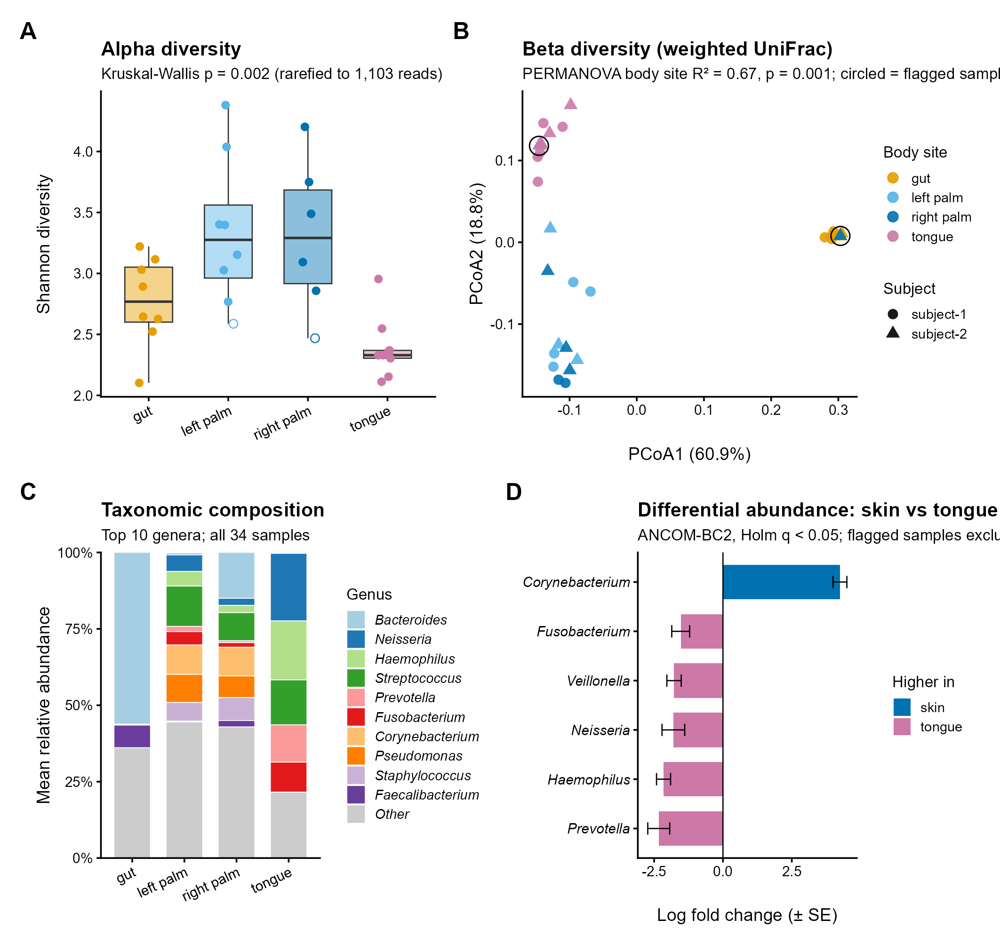

# 16S rRNA Amplicon Microbiome Analysis in R — *Moving Pictures* Dataset

An end-to-end 16S rRNA amplicon analysis of the QIIME 2 **"Moving Pictures of the Human Microbiome"** tutorial dataset, reproduced entirely in **R / Bioconductor**, from raw multiplexed FASTQ files to statistical testing and a publication-quality figure.

The QIIME 2 tutorial (release 2024.10) served as the reference workflow; every step was re-implemented in R (DADA2, phyloseq, vegan, ANCOM-BC2) and the results were compared with the tutorial's parameters and outputs.



**Figure 1.** (A) Shannon diversity by body site (rarefied to 1,103 reads). (B) PCoA of weighted UniFrac distances; circled points are day-0 palm samples flagged as probable cross-contamination. (C) Mean genus-level composition by body site. (D) Genera differentially abundant between skin (palms) and tongue (ANCOM-BC2, Holm q < 0.05).

---

## Key findings

1. **Body site, not the individual, shapes the microbiome.** Body site explained **28–67 %** of community variation (PERMANOVA, p = 0.001 across Jaccard, Bray–Curtis, unweighted and weighted UniFrac), whereas subject explained only **2–6 %**.
2. **Three distinct habitats: gut, tongue and skin.** Left- and right-palm communities were statistically indistinguishable (pairwise PERMANOVA p ≥ 0.97) and formed a single skin community.
3. **Skin is the most diverse habitat, the tongue the least.** Mean observed ASVs: palms 80–86, gut 60, tongue 30 (Kruskal–Wallis p = 0.001); the same pattern held for Shannon diversity, Pielou evenness and Faith's PD (p ≤ 0.014).
4. **Each habitat has a characteristic community.** Gut: *Bacteroides* (56 %), *Faecalibacterium*, Lachnospiraceae. Tongue: *Neisseria*, *Haemophilus*, *Streptococcus*, *Prevotella*, *Fusobacterium*, *Veillonella*. Skin: *Corynebacterium*, *Staphylococcus*, *Pseudomonas*, *Acinetobacter*, *Lawsonella*.
5. **Individual signature in the gut.** The two subjects' gut communities differed significantly only in ***Alistipes*** (ANCOM-BC2 LFC 4.3, q = 0.007): 1.8–5.2 % of reads in every subject-2 gut sample versus ≤ 0.06 % in every subject-1 sample.
6. **Quality-control finding: probable cross-contamination on day 0.** All three palm samples collected on the first sampling day (L2S240, L3S378, L3S242; both subjects) showed gut- or tongue-like profiles. Two were near-duplicates of the same subject's same-day tongue or gut sample (Bray–Curtis 0.15 and 0.26, versus median within-site distances of 0.48 and 0.69), while those gut and tongue samples clustered normally. Conclusions were robust to their exclusion, which strengthened the body-site effect (weighted UniFrac R² 0.67 → 0.77).

---

## Dataset

| | |
|---|---|
| Study | Caporaso *et al.* (2011) *Moving pictures of the human microbiome*, Genome Biology 12:R50 |
| Samples | 34: two subjects × four body sites (gut, tongue, left palm, right palm) over time |
| Sequencing | Illumina, single-end 16S rRNA V4 region (EMP protocol), 302,581 reads × 152 bp |
| Source | QIIME 2 2024.10 tutorial data: `https://data.qiime2.org/2024.10/tutorials/moving-pictures/` |

---

## Workflow

| Episode | Script | What it does | QIIME 2 equivalent |
|---|---|---|---|
| 00 | `00_setup_packages.R` | Installs all packages | — |
| 02 | `02_download_data.R` | Downloads data; explores metadata | data download |
| 03 | `03_import_demultiplex.R` | Imports FASTQ; demultiplexes by exact barcode match | `demux emp-single` |
| 04 | `04_quality_control.R` | Quality profiles; filtering (truncLen 120, maxEE 2, maxN 0, truncQ 2) | `demux summarize` |
| 05 | `05_dada2_asv.R` | Error model, ASV inference, consensus chimera removal | `dada2 denoise-single` |
| 06 | `06_taxonomy.R` | Naive Bayes classification, SILVA 138.2 | `feature-classifier classify-sklearn` |
| 07 | `07_feature_table.R` | phyloseq object; removes mitochondria, chloroplast, Eukaryota, unassigned phyla | `feature-table summarize` |
| 08 | `08_alpha_diversity.R` | Rarefaction (1,103 reads); Observed, Shannon, Pielou; Kruskal–Wallis | `core-metrics`, `alpha-group-significance` |
| 09 | `09_beta_diversity.R` | Alignment, NJ tree, Faith's PD; four distance metrics; PCoA | `align-to-tree-mafft-fasttree`, `core-metrics-phylogenetic` |
| 10 | `10_permanova.R` | PERMANOVA, betadisper, pairwise tests, restricted permutations, sensitivity analysis | `beta-group-significance` |
| 11 | `11_taxonomic_composition.R` | Phylum/genus bar plots and tables | `taxa barplot` |
| 12 | `12_differential_abundance.R` | ANCOM-BC2: gut (subject) and skin vs tongue | `composition ancombc` |
| 13 | `13_publication_figure.R` | Multi-panel Figure 1 (PNG + PDF) | — |

### Read tracking

| Step | Reads | % of raw |
|---|---|---|
| Raw | 302,581 | 100 % |
| Demultiplexed (exact barcode match) | 263,878 | 87.2 % |
| Quality filtered | 162,811 | 53.8 % |
| Non-chimeric (after DADA2) | ≈153,850* | 50.8 % |

\*34 samples × mean 4,525 reads; chimera removal retained 96.5 % of denoised reads. Exact per-sample counts are in `results/tables/05_denoising_stats.csv`. The final table contains **771 ASVs** (731 after removing 40 non-target ASVs, 1.5 % of reads). Taxonomy was assigned to genus level for 79.5 % of ASVs.

### Differences from the QIIME 2 tutorial

| Step | QIIME 2 tutorial | This project | Consequence |
|---|---|---|---|
| Demultiplexing | Golay error-correcting barcodes | Exact barcode match | 12.8 % of reads unassigned; slightly fewer reads per sample |
| Taxonomy database | Greengenes | SILVA 138.2 (current phylum names, e.g. Bacillota = Firmicutes) | Different names; same biology |
| Phylogeny | MAFFT + FastTree | DECIPHER + neighbour-joining (midpoint-rooted) | Minor differences in UniFrac / Faith's PD values |
| Contaminant filtering | Not performed | Mitochondria, chloroplast, Eukaryota removed | Cleaner skin profiles |
| Extra analyses | — | Sensitivity analyses, betadisper, restricted permutations, contamination diagnostics | More robust inference |

One sample (L3S313) retained exactly 1,103 reads after DADA2, matching the tutorial's rarefaction depth, which suggests close agreement between the R and QIIME 2 denoising.

---

## Biological interpretation

**Habitat filtering dominates.** Each body site imposes strong selective conditions: the anaerobic, nutrient-rich gut favours *Bacteroides* and butyrate-producing Firmicutes (*Faecalibacterium*, Lachnospiraceae); the moist, oxygen-gradient environment of the tongue supports a specialised oral consortium (*Neisseria*, *Haemophilus*, *Streptococcus*, *Veillonella*, *Prevotella*, *Fusobacterium*); and dry, lipid-rich skin selects for *Corynebacterium*, *Staphylococcus* and *Lawsonella*. These conditions matter far more than the host individual, as reflected in the large body-site R² and small subject R².

**Skin is diverse because it is exposed.** Palms had the highest richness and phylogenetic diversity, reflecting continual input from the environment, other people and the body itself; oral streptococci on the palms illustrate hand–mouth transfer. The two hands shared one community, consistent with constant contact between them and the same surfaces.

**The tongue is species-poor but consistent.** A few genera accounted for ~89 % of reads, giving low richness and a tight cluster in ordination.

**Individuality lies in specific taxa, not lineages.** Subject differences were significant for Jaccard and Bray–Curtis but not for UniFrac: the two people carry different ASVs (strains) of the same site-specific lineages. *Alistipes* in the gut is the clearest example, a stable, person-specific trait across all time points.

**Why the quality-control finding matters.** Without checking, the three contaminated palm samples would have inflated palm *Bacteroides* (e.g. 15 % mean in right palm) and oral genera, weakened the body-site signal, and could have produced false "skin-associated" taxa in differential abundance testing. Because the anomaly was confined to palm samples collected on day 0, a sampling-day handling issue is the most plausible cause.

---

## Limitations

- **Two individuals only.** Findings about individuality cannot be generalised; the study design is a time series, not a population sample.
- **Small groups** (8–9 samples per body site) limit statistical power, particularly for subject-level differential abundance (8 gut samples).
- **Short reads.** 120 bp single-end V4 reads resolve genera but rarely species (24 % species-level assignment, exact matches only).
- **Rarefaction** discards data (McMurdie & Holmes, 2014); results were therefore confirmed at a second depth (824 reads, all samples).
- **Dispersion differences** between body sites (betadisper p ≤ 0.01) mean PERMANOVA reflects both location and spread, although PCoA shows clearly separated clusters.
- **Structural zeros.** Genera confined to one habitat are not captured by the standard ANCOM-BC2 test, so differential-abundance results are conservative.
- **Confounding at day 0.** Antibiotic use, sampling contamination and study start coincide; the observed increase in Shannon diversity over time (Spearman ρ = 0.42, p = 0.017) should be treated as exploratory.

---

## Repository structure

```
16S-Amplicon-Microbiome-Analysis-R/
├── scripts/                 # Analysis scripts, run in numerical order
├── data/
│   ├── sample-metadata.tsv  # Study metadata
│   ├── raw/                 # Raw FASTQ (git-ignored; downloaded by script 02)
│   ├── reference/           # SILVA files (git-ignored; downloaded by script 06)
│   └── processed/           # Intermediate R objects (.rds)
├── results/
│   ├── figures/             # All figures, including Figure 1
│   └── tables/              # All result tables (.csv)
├── docs/
│   └── sessionInfo.txt      # R and package versions used
└── 16S-Amplicon-Microbiome-Analysis-R.Rproj
```

---

## How to reproduce

1. Clone the repository and open `16S-Amplicon-Microbiome-Analysis-R.Rproj` in RStudio.
2. Run `scripts/00_setup_packages.R` once to install packages (R ≥ 4.4, Bioconductor).
3. Run the scripts in order, `02` to `13`. Raw data and SILVA reference files are downloaded automatically.
4. Package versions are recorded in `docs/sessionInfo.txt`.

Tested on Windows 11 with R 4.4.1 (`multithread = FALSE`); on macOS/Linux, DADA2 steps can be sped up with `multithread = TRUE`.

---

## References

- Bolyen E, *et al.* (2019) Reproducible, interactive, scalable and extensible microbiome data science using QIIME 2. *Nature Biotechnology* 37:852–857.
- Callahan BJ, *et al.* (2016) DADA2: High-resolution sample inference from Illumina amplicon data. *Nature Methods* 13:581–583.
- Callahan BJ (2024) Silva taxonomic training data formatted for DADA2 (Silva version 138.2). Zenodo. doi:10.5281/zenodo.14169026
- Caporaso JG, *et al.* (2011) Moving pictures of the human microbiome. *Genome Biology* 12:R50.
- Faith DP (1992) Conservation evaluation and phylogenetic diversity. *Biological Conservation* 61:1–10.
- Kembel SW, *et al.* (2010) Picante: R tools for integrating phylogenies and ecology. *Bioinformatics* 26:1463–1464.
- Lin H, Peddada SD (2024) Multigroup analysis of compositions of microbiomes with covariate adjustments and repeated measures. *Nature Methods* 21:83–91.
- Lozupone C, Knight R (2005) UniFrac: a new phylogenetic method for comparing microbial communities. *Applied and Environmental Microbiology* 71:8228–8235.
- McMurdie PJ, Holmes S (2013) phyloseq: an R package for reproducible interactive analysis and graphics of microbiome census data. *PLoS ONE* 8:e61217.
- McMurdie PJ, Holmes S (2014) Waste not, want not: why rarefying microbiome data is inadmissible. *PLoS Computational Biology* 10:e1003531.
- Oksanen J, *et al.* vegan: Community Ecology Package. R package.
- Quast C, *et al.* (2013) The SILVA ribosomal RNA gene database project. *Nucleic Acids Research* 41:D590–D596.
- Schliep KP (2011) phangorn: phylogenetic analysis in R. *Bioinformatics* 27:592–593.
- Wright ES (2016) Using DECIPHER v2.0 to analyze big biological sequence data in R. *The R Journal* 8:352–359.

---

## Author

**Harshani Hathurusinghe**: Soil microbiology, Microbiome bioinformatics | Molecular biology
GitHub: [@Harshi7493](https://github.com/Harshi7493) · [LinkedIn](https://www.linkedin.com/in/harshani-hathurusinghe-0b417034)

*Analysis developed as part of a microbiome bioinformatics portfolio, following the QIIME 2 Moving Pictures tutorial as the reference workflow.*
